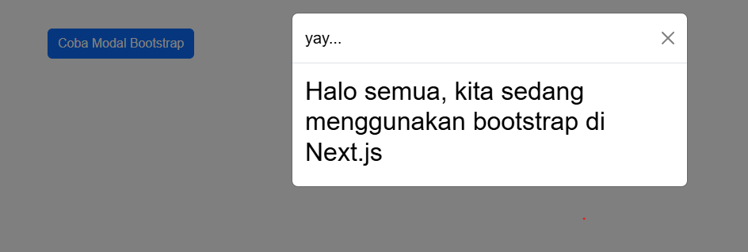
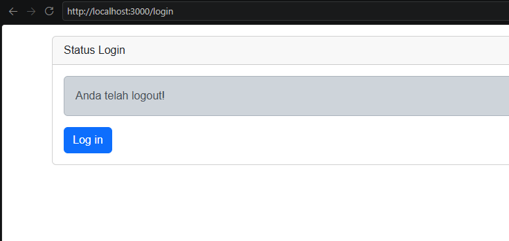
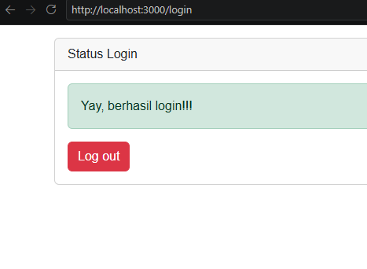
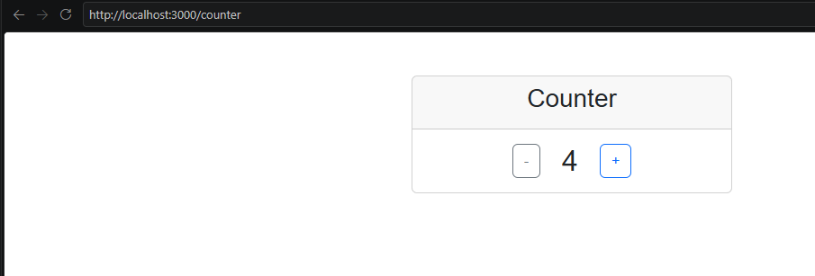
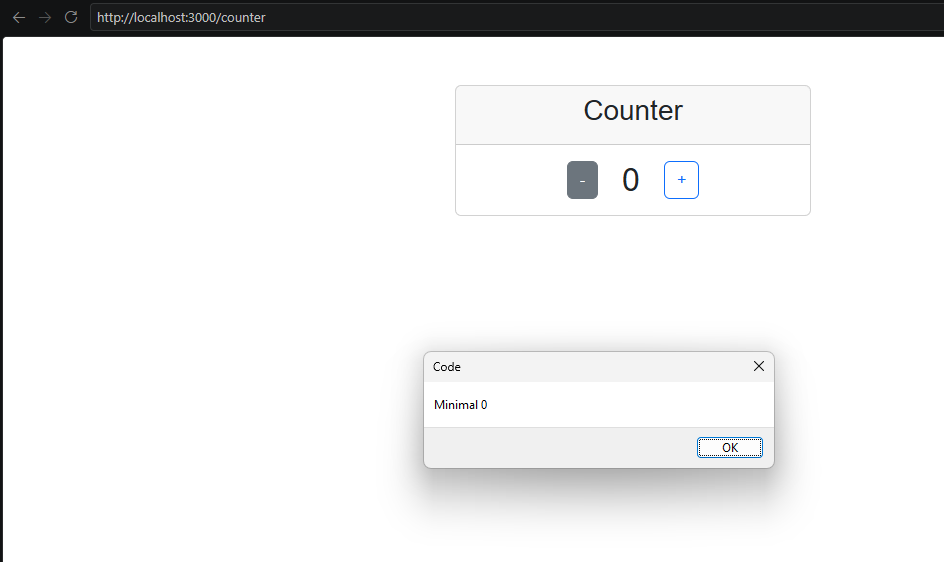

# Modul 7 - Redux pada Next.js

Repository ini berisi hasil praktikum Modul 7 Pemrograman Web Enterprise mengenai penggunaan Bootstrap dan Redux pada Next.js menggunakan Pages Router.

## Praktikum 1 - Instalasi Bootstrap

Pada praktikum pertama dilakukan instalasi Bootstrap dan implementasi Bootstrap Modal pada Next.js.

Bootstrap CSS di-import pada `pages/_app.tsx`, sedangkan JavaScript Bootstrap dijalankan pada sisi client menggunakan `useEffect`.

### Hasil Praktikum



---

## Praktikum 2 - Login dengan Redux

Pada praktikum kedua digunakan Redux Toolkit untuk mengelola state login.

Library yang digunakan antara lain:

- `@reduxjs/toolkit`
- `react-redux`
- `redux-persist`
- `next-redux-wrapper`
- `html-react-parser`

State login disimpan pada reducer `auth`.

Redux Persist digunakan agar state login tetap tersimpan ketika halaman di-refresh.

### Kondisi Login



### Kondisi Logout



---

## Praktikum 3 - Counter dengan Redux

Pada praktikum ketiga dibuat aplikasi counter sederhana menggunakan Redux.

State `totalCounter` disimpan pada reducer `counter`.

Tombol `+` digunakan untuk menambah nilai dan tombol `-` untuk mengurangi nilai. Nilai counter dibatasi agar tidak kurang dari `0`.

### Counter



### Batas Minimum Counter



---

# Jawaban Pertanyaan Praktikum

## 1. Apa kegunaan `useEffect` pada file `pages/_app.tsx`?

`useEffect` digunakan untuk menjalankan kode setelah komponen dirender pada sisi client atau browser.

Pada praktikum ini `useEffect` digunakan untuk memuat JavaScript Bootstrap:

```tsx
useEffect(() => {
  import("bootstrap");
}, []);
```

Dengan demikian JavaScript Bootstrap dijalankan setelah aplikasi berada pada lingkungan browser.

## 2. Apa yang terjadi jika `useEffect` dihapus?

Pada implementasi praktikum ini, jika bagian `useEffect` beserta pemanggilan JavaScript Bootstrap dihapus, fitur Bootstrap yang membutuhkan JavaScript tidak akan berjalan dengan benar.

Contohnya adalah Bootstrap Modal. Tampilan CSS Bootstrap masih dapat terlihat, tetapi interaksi seperti membuka dan menutup modal dapat tidak bekerja.

## 3. Mengapa atribut HTML `class` diganti menjadi `className`?

React dan Next.js menggunakan JSX.

Pada JSX, atribut CSS ditulis menggunakan `className`, bukan `class`.

Contoh:

```tsx
<div className="container">
```

`className` kemudian akan diterjemahkan menjadi atribut `class` pada HTML yang dihasilkan di browser.

## 4. Apakah store pada Next.js dapat menyimpan banyak Redux reducer?

Ya.

Satu Redux store dapat menggunakan beberapa reducer. Reducer tersebut dapat digabung menggunakan `combineReducers`.

Pada praktikum ini contohnya:

```js
const rootReducer = combineReducers({
  auth: authReducer,
  counter: counterReducer,
});
```

Artinya satu store menyimpan state dari reducer `auth` dan reducer `counter`.

## 5. Apa kegunaan file `store.js`?

File `store.js` digunakan sebagai pusat konfigurasi Redux Store.

File tersebut menggabungkan reducer, membuat Redux store, mengatur middleware, serta mengatur `redux-persist` agar state tertentu dapat disimpan secara persisten.

Pada project ini store mengelola state `auth` dan `counter`.

## 6. Apa maksud kode berikut pada `pages/login.tsx`?

```tsx
const { isLogin } = useSelector((state) => state.auth);
```

`useSelector` digunakan untuk mengambil data dari Redux Store.

`state.auth` mengakses state yang dikelola oleh reducer `auth`, kemudian property `isLogin` digunakan untuk mengetahui apakah pengguna sedang dalam kondisi login atau logout.

## 7. Apa maksud kode berikut pada `pages/counter.tsx`?

```tsx
const { totalCounter } = useSelector((state) => state.counter);
```

Kode tersebut mengambil state `totalCounter` dari reducer `counter` yang tersimpan di Redux Store.

Nilai `totalCounter` kemudian digunakan untuk menampilkan nilai counter pada halaman.

---

# Kesimpulan

Pada Modul 7 dipelajari penggunaan state management Redux pada Next.js.

Redux memungkinkan state aplikasi disimpan secara terpusat sehingga dapat digunakan oleh berbagai komponen. Redux Toolkit membantu menyederhanakan pembuatan reducer dan action, sedangkan Redux Persist memungkinkan state tertentu tetap tersimpan setelah halaman di-refresh.

Selain itu, praktikum ini juga memperkenalkan integrasi Bootstrap pada aplikasi Next.js.